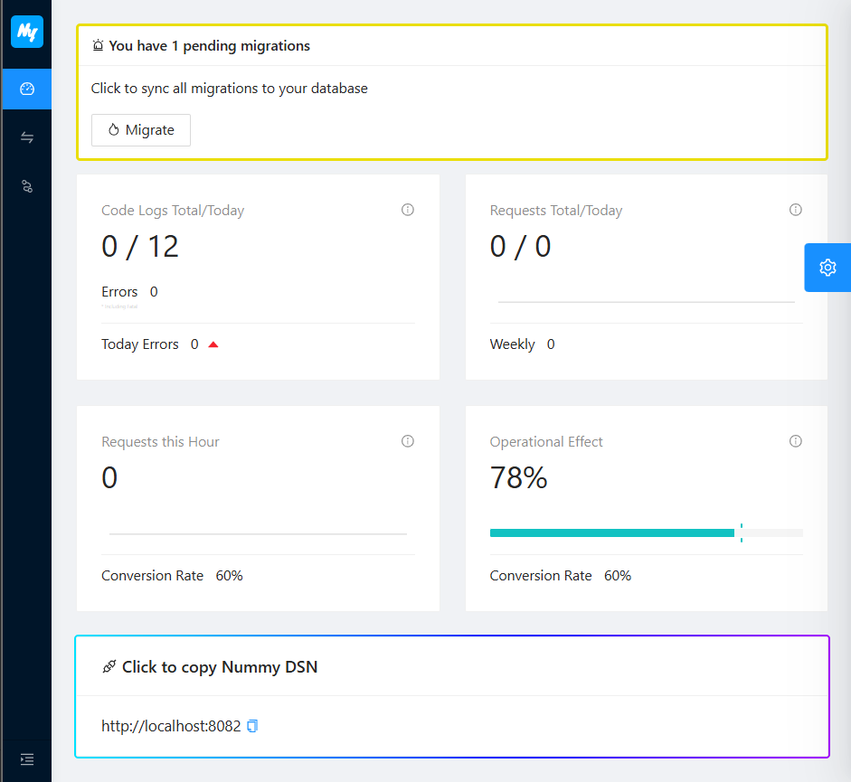
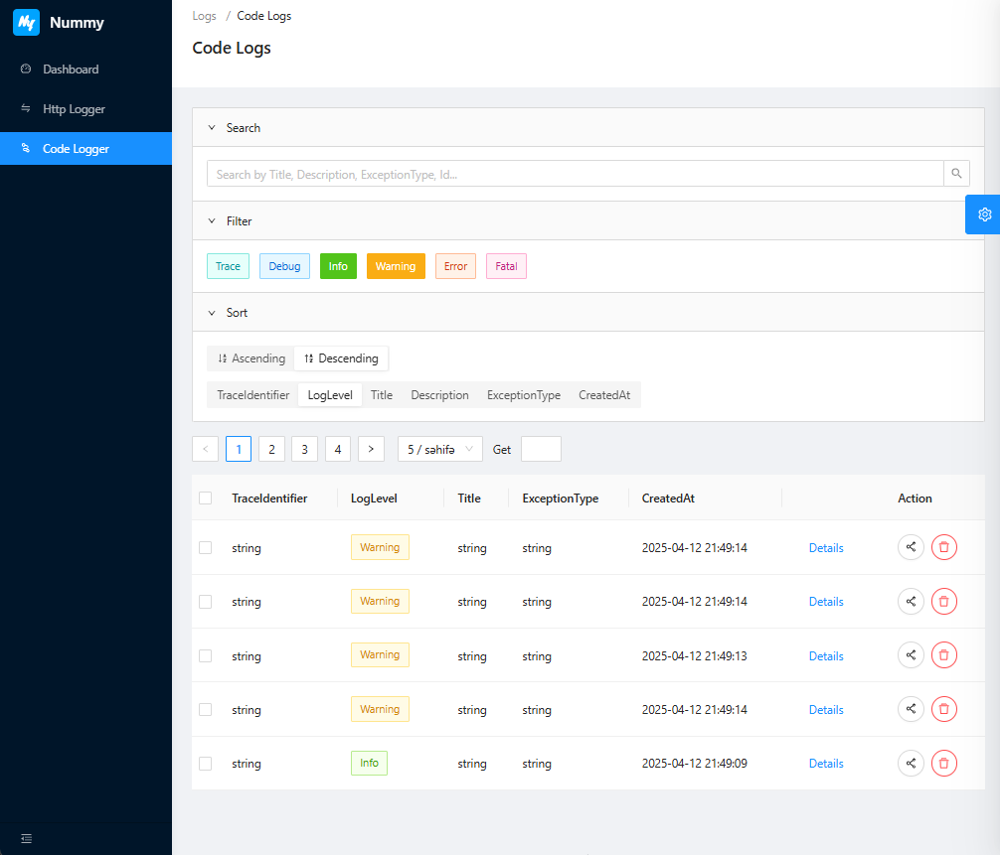

## Nummy 💎

Nummy is a web application that shows your applications logs and exceptions, request & response logs in one place using theese packages:

[Nummy.CodeLogger](https://www.nuget.org/packages/Nummy.CodeLogger) - to log any information you need
[Nummy.ExceptionHandler](https://www.nuget.org/packages/Nummy.ExceptionHandler) - to handle exceptions correctly
[Nummy.HttpLogger](https://www.nuget.org/packages/Nummy.HttpLogger) - to log http requests and responses

It is built using .NET Core, Entity Framework Core, and PostgreSQL.

---

### 🛠️ To set up Nummy using Docker:

1. Download [docker-compose.yml](https://github.com/solarvoyager/Nummy/blob/master/docker-compose.yml) file.
2. Compose it with:
   ```bash
   docker compose up --detach
   ```
3. Go to http://localhost:8080/ in you browser.
4. Go to Applications section to Create a new Application.
5. Open Application and Copy your Application Id and Service Url to use in package configurations.

---

### 🚀 When You want Safely Update

1. Copy or download latest [docker-compose.yml](https://github.com/solarvoyager/Nummy/blob/master/docker-compose.yml) file.
2. Pull the latest image versions:
```bash
docker compose pull api ui
```
3. Recreate only the updated services (API/UI):
```bash
docker compose up -d --no-deps --build api ui
```
💡 *The `nummy-postgres` container and its data volume (`nummy_postgres-data`) will remain untouched.*

### Screens




